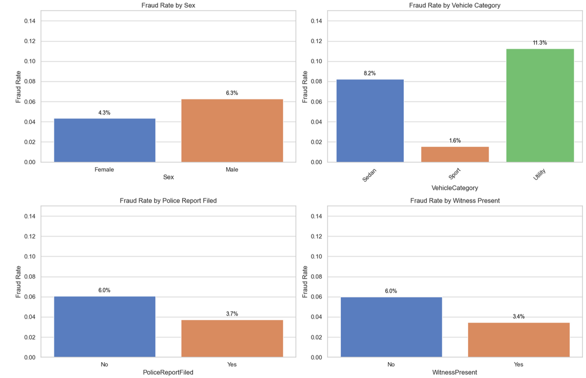
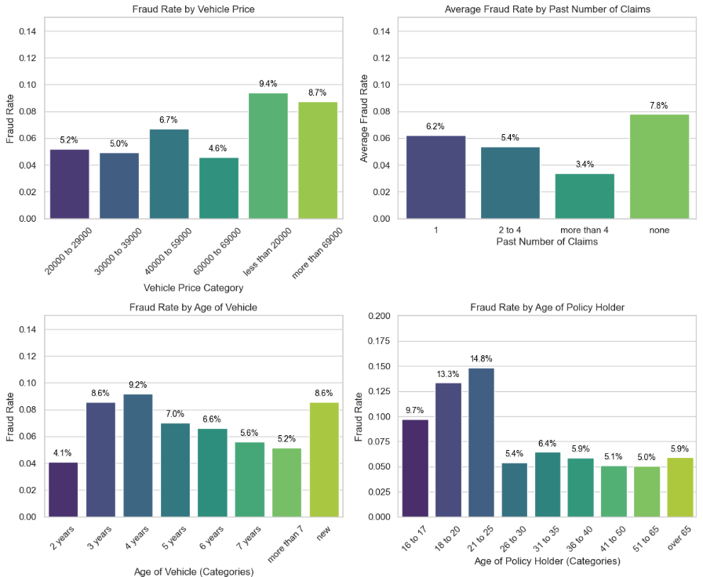
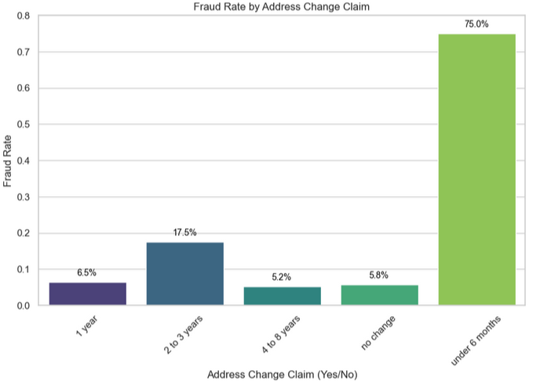
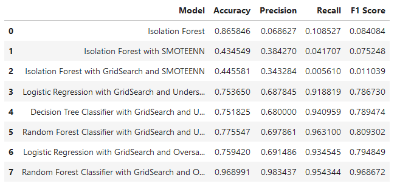

# Vehicle Insurance Claim Fraud Detection using Machine Learning 

This project focuses on developing a machine learning model to detect fraudulent vehicle insurance claims. By analyzing historical claim data, various features such as claim amount, vehicle details, customer information, and accident history were used to train a classifier to differentiate between legitimate and fraudulent claims. The project aims to minimize financial losses for insurance companies by accurately identifying fraudulent activity, improving claim processing efficiency, and reducing the manual effort required for fraud detection

## Resources Used

**Python Version**: 3.12.1

**Packages**: pandas,numpy,sklearn,matplotlib,seaborn,scipy, imblearn

**Dataset**: (https://www.kaggle.com/datasets/shivamb/vehicle-claim-fraud-detection)

## Exploratory Data Analysis

Probably the clearer discovery of the EDA was that people commiting fraud are usually sneaky or try to take advantage of the situation to do it, since most fraud cases are commited when there are no witness present, when there is no police report filed, and 75% of those that change their adresse in their last 6 months commited fraud, as if they were trying to hide from something.

## Data Cleaning

The data cleaning was quite extensive, since most of the variables that could easily be numerical, and in that way add more value to our analysis, were categorical. Also, some unnecesary variables were eliminated of the dataset.
The following variables were preprocessed and converted to numerical:

* VehiclePrice
* Days_Policy_Accident
* Days_Policy_Claim
* PastNumberOfClaims
* AgeOfVehicle
* AgeOfPolicyHolder
* NumberOfSuppliments
* AddressChange_Claim
* NumberOfCars

It was neeeded to make asumptions in all of them, since many of them had categories such as "more than * amount of years* of *between x and y*. In the first case, a maximum number was selected, and then an average calculated, and in the second, just the average between both values.

The categorical values that could not be converted to numeric because of their nature, were converted to dummy variables.

## Model Implementation

7 different models were built. The dataset was scaled, and as it was seen that the models were struggling with imbalanced data, later on, both under-sampling and over-sampling were conducted

* Isolation Forest
* Isolation Forest with SMOTEENN
* Isolation Forest with GridSearch and SMOOTEENN
* Logistic Regression with GridSearch and Undersampling
* Decision Tree Classifier with GridSearch and Undersampling
* Random Forest Classifier with GridSearch and Undersampling
* Logistic Regression with GridSearch and Oversampling
* Random Forest Classifier with GridSearch and Oversampling

## Model Performance

The Random Forest Classifier with GridSearch and Oversampling model is very effective, achieving high accuracy, precision, recall, and F1 scores. The choice of hyperparameters suggests a model well-tuned to the data, capturing its complexity while still generalizing well.

